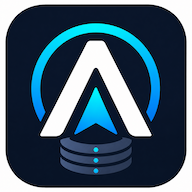

<p align="center">
  
</p>

# Atlas

Atlas is an open-source operations platform for Ceph. It focuses on how organizations operate Ceph fleets: cases, workflows, policy, audit, RBAC, inventory, and safe automation.

Atlas is not a replacement for Ceph, Ceph Dashboard, Prometheus, Grafana, NetBox, OpenSearch, Splunk, or configuration management. It is the operational control plane that coordinates work across those systems.

## The problem Atlas solves

Ceph tells you *that* something is wrong — an OSD is down, a pool is near full, a host needs draining. It deliberately does not govern *how your team responds*. Operating a fleet today usually means some mix of these:

- Runbooks and tribal knowledge: the recovery procedure for a failed
  Storage Device lives in a wiki page, a chat thread, or one engineer's
  head, and drifts from what the cluster actually needs.
- Approval by chat: the destructive step between "we should replace this
  device" and `ceph orch osd rm` is a thumbs-up emoji with no durable
  record of who authorized what, when, or why.
- Risky manual mutations: operators paste commands against production
  storage, where a typo or a stale runbook can turn one dead drive into
  an outage.
- No operational history: once the incident closes, the reasoning, the
  approvals, and the exact steps taken are scattered or gone — nothing
  helps the next person facing the same failure.

Atlas closes that gap by making the *response itself* a durable, governed
object. A firing condition becomes a Case. A Case carries a Workflow:
typed, auditable steps where read-only collection runs automatically,
destructive mutations pause at an Approval Gate until a human records
authorization, and physical work pauses as a human Task. Every
transition — who did what, under whose approval, with what outcome — is
recorded on the Case Timeline. The result is a fleet where the safe path
is also the easy path, and where the operational history compounds
instead of evaporating.

If you want to contribute, these are the seams we are actively building:
the Case and Workflow model, the typed Agent operation contract, the
provider layer that reads real Ceph, and the attention-driven UI that
surfaces what needs a human. See [Status](#status) for what exists
today and [Roadmap](#roadmap) for where it goes next.

## Status

Atlas is in active early development as an open design-and-prototype project. It is **not production-ready** and should not be used to operate real Ceph clusters yet.

What exists today:

- Go backend with a REST API v1: read-only inventory and Case endpoints plus
  authenticated manual Case write endpoints (create, transition, assign, note)
- OIDC bearer-token identity verification (JWT against the issuer's JWKS) with
  a local dev issuer for development stacks
- React and TypeScript web UI on IBM Carbon (ADR-0028) with a searchable
  cluster index, per-cluster detail pages, global Cases and Sync Runs
  views, operator sign-in, manual Case writes, and Workflow
  attach/approve/resume forms
- PostgreSQL persistence with plain SQL migrations
- Fake-provider inventory fixtures and an inventory sync command
- A read-only real Ceph provider: `ATLAS_PROVIDER_MODE=ceph` points the
  inventory sync command at a live Ceph Dashboard REST API with a dedicated
  read-only user (ADR-0023). Explicit opt-in; local development and tests
  never require a real cluster (the provider is tested against an in-process
  fake Dashboard)
- Fake-provider alert evaluation that automatically creates a Case (with
  Timeline Events and deduplication) from a firing alert, plus a real
  Prometheus alert source: `ATLAS_ALERT_SOURCE=prometheus` points
  `atlas-alert-eval` at a live `/api/v1/alerts` endpoint (ADR-0027).
  Explicit opt-in; local development and tests stay on fixtures (the
  provider is tested against an in-process fake Prometheus)
- Cluster Registration with one-time Enrollment Credentials, and Agent
  Enrollment (ADR-0025/0026): `POST /api/v1/agent/enroll` burns the
  credential, binds the Cluster's FSID, and issues a client certificate
  from an internal CA configured through control-plane paths
  (`ATLAS_ENROLLMENT_CA_CERT_PATH`/`ATLAS_ENROLLMENT_CA_KEY_PATH`).
  Tests use an in-process test CA; ordinary local development paths
  configure no CA key material
- Seeded read-only Case and Case Timeline records
- A Workflow execution skeleton (ADR-0017 through ADR-0022): the Replace OSD
  Workflow attaches to a Case, pauses at its Approval Gate and human Task,
  and a fake Agent adapter drives its typed Jobs (with retry policies and
  idempotent re-dispatch) to terminal state — all state is durable in
  PostgreSQL
- A local Docker Compose stack for the full development environment,
  including the full fake workflow loop

What does not exist yet:

- Rook providers, and real-cluster reads (reads arrive through an
  enrolled Atlas Agent per ADR-0025, not through the control plane)
- A dispatching Atlas Agent or any mutating operation against Ceph (the fake
  Agent adapter only simulates Job execution)
- RBAC, policy, and Audit Events (any authenticated operator can approve
  gates and complete tasks; see ADR-0016)
- Notifications, and the Atlas Agent component itself: Enrollment and
  certificate issuance exist, but the Agent that enrolls and reports in
  does not yet

## Roadmap

Atlas is working toward a production-usable single-zone `v0.1.0`. Each
`0.0.x` patch is a coherent development milestone; stability commitments
begin at `v0.1.0`.
The full ladder lives in [`dev-plans/roadmap.md`](dev-plans/roadmap.md).

- **v0.0.8 — Registered Reads:** cluster registration and Enrollment, a
  read-only Atlas Agent pushing observations from real clusters, and real
  alert ingestion creating Cases automatically
- **v0.0.9 — Safety Chain:** hierarchical RBAC, policy evaluation, and
  immutable Audit Events
- **v0.0.10 — Real Mutations:** mutual TLS hardening, typed approved operations,
  and the Replace OSD workflow executing real mutations end to end
- **v0.0.11 — Read Matrix Widening:** Ceph 19 and 20 Dashboard fixtures and
  read contract coverage, ahead of Ship
- **v0.1.0 — Ship:** deployment artifacts, bootstrap runbook, user docs, and
  a security review — usable by a stranger, single-zone

After v0.1.0: **v0.2.0 — Federation** (multi-zone), then **v0.3.0 — Rook
and Version Breadth** (Rook-managed Ceph first-class plus Ceph 19/20
mutation validation), then chat notifications and the broader enterprise
platform direction (NetBox, log links, external ticket trackers).

## Versioning

Atlas follows [Semantic Versioning](https://semver.org/). While Atlas is
below `v0.1.0`, anything may change at any time and the API, database
schema, and configuration are not stable.

Development happens in the `0.0.x` patch line: each release
(`v0.0.2`, `v0.0.3`, ...) is a coherent development milestone and may
include breaking changes, which will be described in the release notes.
Stability commitments begin at `v0.1.0` with minors-as-majors semantics:
patches are always safe, breaking changes land only at minor boundaries
with migration notes, and deprecations are flagged one minor ahead.

The first seven releases were published as `v0.1.0` through `v0.6.1` and
were renumbered down to `v0.0.1` through `v0.0.7` on 2026-09-01, before
the project had any users or published binaries, to reserve `v0.1.0` for
the first release intended to be usable by others.

The `/api/v1` path segment identifies the REST API contract direction; below
`v0.1.0` it does not imply a stability guarantee.

## Documentation

- `dev-plans/product_vision.md` - product vision and principles
- `dev-plans/prd.md` - product requirements
- `dev-plans/hld.md` - high-level architecture
- `dev-plans/domain_model.md` - canonical product language
- `dev-plans/mvp.md` - v0.1.0 scope document
- `dev-plans/roadmap.md` - version ladder to 0.1.0 and post-0.1.0 direction
- `dev-plans/scale_tiers.md` - scale targets by deployment tier
- `dev-plans/environment_context.md` - example operating environment context and portability rules
- `dev-plans/ceph_compatibility.md` - Ceph version and cluster type compatibility posture
- `dev-plans/provider_api_research.md` - official Ceph and Rook API research for provider design
- `dev-plans/provider_contracts.md` - provider boundary and method contracts
- `dev-plans/case_timeline.md` - Case Timeline read model and event type proposal
- `dev-plans/local_development_topology.md` - local development modes and safety defaults
- `dev-plans/repository_layout.md` - initial source tree and package boundaries
- `dev-plans/mvp_test_strategy.md` - MVP test tiers and scaffold readiness criteria
- `dev-plans/security_review_checklist.md` - privileged operation review gate
- `dev-plans/public_readiness_checklist.md` - open-source publication audit trail
- `docs/adr/` - accepted architecture decisions
- `CONTEXT.md` - concise ubiquitous language for contributors

## Local Development

The narrow dependency-only path starts PostgreSQL on `127.0.0.1:15432`:

```sh
make db-up
```

The full local stack runs PostgreSQL, applies migrations, seeds one fake
inventory snapshot, runs one fake alert evaluation that creates a detected
Case, starts a local dev OIDC issuer on `127.0.0.1:18090`, starts the API on
`127.0.0.1:8080`, and starts the web UI on `127.0.0.1:5173`. It also runs
the whole enrolled Agent loop with nothing real except the software itself:
a fixture-backed fake Ceph Dashboard service, an ephemeral dev certificate
authority generated inside the API container at every start, and a real
`atlas-agent` that enrolls against the real enrollment endpoint using a
registration a bootstrap creates through the API, collects from the fake
Dashboard, and pushes observations over real mutual TLS. The pushed cluster
(`dev-agent-reef`) coexists with the seeded fake scenarios.

```sh
make dev-stack-up
```

If a local port is already occupied, override `ATLAS_API_PORT`,
`ATLAS_WEB_PORT`, or `ATLAS_DEV_ISSUER_PORT` for the compose process.

To sign in to the web UI or call write endpoints, request a dev token from the
dev issuer and use it as a bearer token:

```sh
curl -s -X POST http://127.0.0.1:18090/token | jq -r .token
```

### Try the workflow loop

The dev stack runs the API with the fake Agent adapter
(`ATLAS_AGENT_MODE=fake`), so the Replace OSD Workflow runs end to end
against simulated Job execution:

1. Open the web UI at `http://127.0.0.1:5173`, paste the dev token to sign
   in, and open the detected Case (`CephOSDDown on osd=1`) or create a new
   Case.
2. In the Workflows section of the Case detail view, attach `replace-osd`
   version `1`. The instance pauses at its Approval Gate
   (`waiting_for_approval`).
3. Approve the gate. The fake Agent executes the collect and destroy Jobs
   (visible with per-Job state and attempt counters) and the instance
   pauses at the human Task (`waiting_for_operator`).
4. Mark the device-replacement Task done. The final verification Job runs
   and the instance reaches terminal `succeeded`; every step is recorded
   as a Timeline Event on the Case.

The same loop is available over the REST API: `POST
/api/v1/cases/{id}/workflows`, `POST
/api/v1/workflow-instances/{id}/approvals`, and `POST
/api/v1/workflow-instances/{id}/task-completions` (see `api/openapi`).

Run the full-stack smoke check with:

```sh
make dev-stack-check
```

The smoke check exercises the whole loop — attach, approve, complete the
Task, terminal state, Timeline Events — plus 401-without-token assertions
on the write endpoints and the full register → enroll → push → read Agent
loop (including the cluster-scoped reads reflecting agent-pushed
observations). It creates its own probe Case per run, and the bootstrap
retires the previous run's registration before minting a fresh one, so it
stays green against a persistent database volume.

Stop the full stack with:

```sh
make dev-stack-down
```

### Point inventory sync at a real Ceph cluster

The read-only real Ceph provider (ADR-0023) syncs inventory from a live
Ceph Dashboard REST API. It is explicit opt-in: the default local paths and
the dev stack never use it, and no credentials are required anywhere else.

Prerequisites on the Ceph side:

- Ceph 18 (Reef) or newer with the Dashboard mgr module enabled and
  reachable (validated read shapes: Ceph 18; Ceph 19/20 join at v0.0.11)
- a dedicated Dashboard user with a read-only role (for example
  `atlas-reader`)

Then run one sync with:

```sh
ATLAS_PROVIDER_MODE=ceph \
ATLAS_CEPH_DASHBOARD_URL=https://mon.example.invalid:8443 \
ATLAS_CEPH_DASHBOARD_USER=atlas-reader \
ATLAS_CEPH_DASHBOARD_PASSWORD='…' \
ATLAS_CEPH_CLUSTER_NAME=reef-lab \
go run ./cmd/atlas-inventory-sync
```

`ATLAS_CEPH_CLUSTER_NAME` is optional (defaults to `ceph`) because the
Dashboard API does not expose a cluster name. For lab clusters with
self-signed certificates, set `ATLAS_CEPH_DASHBOARD_INSECURE_TLS=true`.

Atlas validates its environment at startup and fails fast: every problem
is reported in one error naming the offending `ATLAS_*` variables.
`ATLAS_PROVIDER_MODE=ceph` requires the Dashboard URL to be an absolute
URL with a scheme plus the read-only credentials, in every command.

Scope notes: this path is read-only and writes one observation batch per
run through the same persistence as the fake provider, and the API read
source (`ATLAS_READ_SOURCE`) still serves from the fake provider or
PostgreSQL.

### Point alert evaluation at a real Prometheus

The real Prometheus observability provider (ADR-0027) evaluates live
alerts from the deployment's existing Prometheus environment. It is
explicit opt-in: the default local paths and CI stay on the fake
fixtures, and no Prometheus is ever required for development.

```sh
ATLAS_ALERT_SOURCE=prometheus \
ATLAS_PROMETHEUS_URL=http://prometheus.example.invalid:9090 \
ATLAS_PROMETHEUS_BEARER_TOKEN='…' \
go run ./cmd/atlas-alert-eval
```

The bearer token is optional (lab deployments often run unauthenticated),
and `ATLAS_PROMETHEUS_INSECURE_TLS=true` accepts self-signed lab
certificates. `ATLAS_ALERT_SOURCE=prometheus` requires
`ATLAS_PROMETHEUS_URL` to be an absolute URL with a scheme, in every
command.

Alerts flow through the same pipeline as the fake fixtures —
normalization, fingerprint dedup, Case creation — and join Clusters by
the alert's `cluster` label resolved to a registered cluster name or
FSID. Add `ATLAS_ALERT_EVAL_INTERVAL=30s` (any Go duration) to keep
evaluating on an interval until shutdown; the default remains one
evaluation per run for dev/CI determinism.

### Enroll an Atlas Agent against a registration

Agent Enrollment (ADR-0026) exchanges a one-time Enrollment Credential
for an Atlas-issued client certificate. `POST /api/v1/agent/enroll`
takes the credential, the Agent's self-reported FSID, and a PEM
certificate signing request; it burns the credential, binds the FSID to
the registered Cluster (immutable, unique), and returns the certificate
chain. The credential in the body is the authentication — this is the
one write endpoint without a bearer token.

Certificates chain to an Atlas-held internal CA. Its key material is
control-plane configuration and never appears in ordinary local
development paths; without it the endpoint answers `422`:

```sh
ATLAS_ENROLLMENT_CA_CERT_PATH=/etc/atlas/ca.crt \
ATLAS_ENROLLMENT_CA_KEY_PATH=/etc/atlas/ca.key \
go run ./cmd/atlas-api
```

Setting one path without the other refuses to start. Issued
certificates carry `commonName=atlas-agent` and client-auth extended
key usage, live for one year (v0.0.8 keeps lifetimes long and renewal
manual — rotation means re-enrollment), and map to exactly one
registered Cluster through their recorded serial number. Revocation in
v0.0.8 is Atlas rejecting the certificate.

### Run the atlas-agent binary

`cmd/atlas-agent` runs the enrolled Agent (ADR-0025): it enrolls on
first start with a locally generated key and the registration's
one-time credential, persists the issued certificate under
`ATLAS_AGENT_STATE_DIR`, then collects full inventory batches from the
local Ceph Dashboard and pushes them over mutual TLS. The Agent is
read-only by construction — no dispatch or command surface — and the
Dashboard credentials never leave the Agent.

```sh
ATLAS_AGENT_ATLAS_URL=https://atlas.example.invalid \
ATLAS_AGENT_ATLAS_CA_PATH=/etc/atlas-agent/atlas-ca.pem \
ATLAS_AGENT_ENROLLMENT_CREDENTIAL='atl_enroll_…' \
ATLAS_AGENT_STATE_DIR=/var/lib/atlas-agent \
ATLAS_AGENT_DASHBOARD_URL=https://mon.example.invalid:8443 \
ATLAS_AGENT_DASHBOARD_USER=atlas-reader \
ATLAS_AGENT_DASHBOARD_PASSWORD='…' \
go run ./cmd/atlas-agent
```

`ATLAS_AGENT_ATLAS_URL` must use `https` because ingestion requires
mutual TLS; `ATLAS_AGENT_ATLAS_CA_PATH` trusts a control plane whose
serving certificate comes from a private CA. `ATLAS_AGENT_COLLECT_INTERVAL`
(default `60s`) drives the ticker, and `-once` runs a single
collect-and-push cycle for deterministic CI runs. Transient failures
back off and retry; permanent ones — a burnt credential, a rejected
certificate, an FSID conflict — stop the Agent for an operator. See
`cmd/atlas-agent/README.md` for the full variable list.

## Contributing

See `CONTRIBUTING.md`. Atlas is design-first: read `CONTEXT.md` and
`docs/adr/` before proposing changes that affect the domain model or
architecture. Please note this project has a `CODE_OF_CONDUCT.md`.

## Security

Atlas is not production-ready. See `SECURITY.md` for how to report
vulnerabilities privately.

## License

Apache License 2.0. See `LICENSE`.

## Trademarks

Atlas is an independent open-source project and is not affiliated with,
sponsored by, or endorsed by the Ceph project or Red Hat. "Ceph" is a
trademark or registered trademark of Red Hat, Inc. or its subsidiaries in
the United States and other countries.
